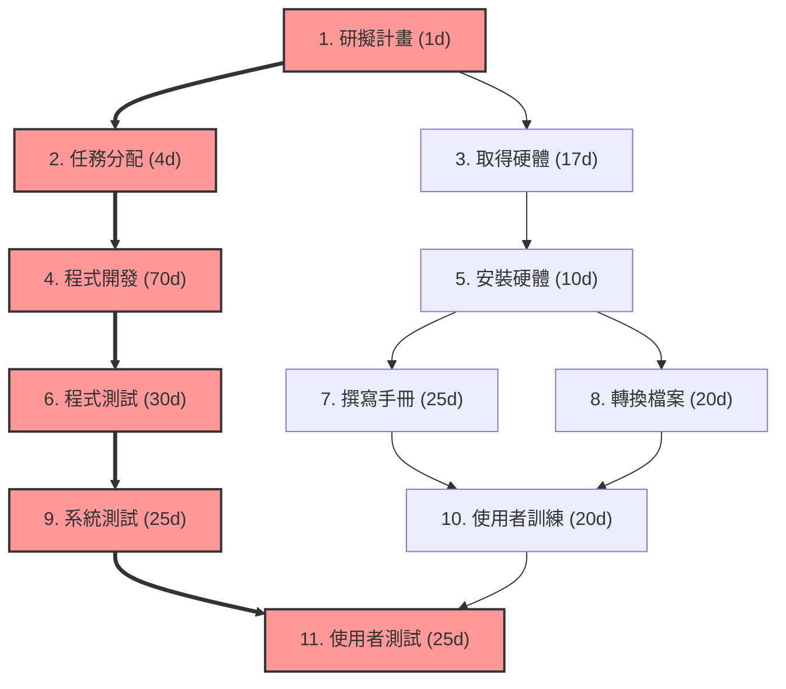
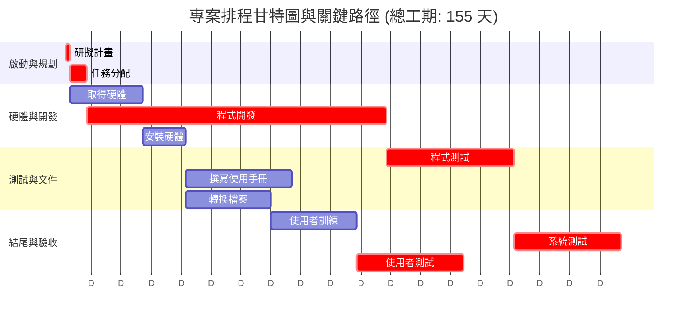

# WBS 專案時程分析報告 (圖 3-27 任務清單)

本文件根據所提供的 11 項任務清單，進行關鍵路徑法 (CPM) 分析，並以 Mermaid 程式碼繪製 PERT/CPM 圖和甘特圖。

## 專案時程總覽與關鍵路徑計算

**專案總工期：** 155 天

| 任務 ID | 任務說明 | 需時 (D, 天) | 前置任務 | ES (最早開始) | EF (最早完成) | LS (最晚開始) | LF (最晚完成) | 浮時 (Slack) | 關鍵路徑 (CP) |
| :---: | :--- | :---: | :---: | :---: | :---: | :---: | :---: | :---: | :---: |
| **1** | **研擬計畫** | **1** | - | **0** | **1** | **0** | **1** | **0** | **是** |
| **2** | **任務分配** | **4** | 1 | **1** | **5** | **1** | **5** | **0** | **是** |
| 3 | 取得硬體 | 17 | 1 | 1 | 18 | 17 | 34 | 16 | 否 |
| **4** | **程式開發** | **70** | 2 | **5** | **75** | **5** | **75** | **0** | **是** |
| 5 | 安裝硬體 | 10 | 3 | 18 | 28 | 24 | 34 | 6 | 否 |
| **6** | **程式測試** | **30** | 4 | **75** | **105** | **75** | **105** | **0** | **是** |
| 7 | 撰寫使用手冊 | 25 | 5 | 28 | 53 | 55 | 80 | 27 | 否 |
| 8 | 轉換檔案 | 20 | 5 | 28 | 48 | 65 | 85 | 37 | 否 |
| **9** | **系統測試** | **25** | 6 | **105** | **130** | **105** | **130** | **0** | **是** |
| 10 | 使用者訓練 | 20 | 7, 8 | 53 | 73 | 90 | 110 | 37 | 否 |
| **11** | **使用者測試** | **25** | 9, 10 | 130 | 155 | 130 | 155 | **0** | **是** |

**關鍵路徑 (Critical Path)**：`1 → 2 → 4 → 6 → 9 → 11`

---

---

